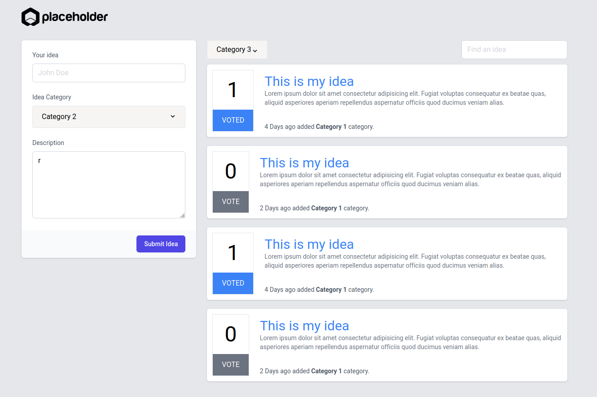

- Bir websitesi için fikirleri paylaşabileceğimiz bir uygulama yapmayı planlıyoruz.
- Projemizi Vue CLI ile oluşturacağız ve Vuex, Vue Router kullanılacak.
- Projemizi mantıklı Vue componentlerine ayırmanızı istiyoruz.
- Fikirler bir array halinde tutulacak ve yeni fikirler en üstte yer alacak.

```js
[
    {
        id: 'this_is_my_idea',
        title: 'This is my idea',
        description: 'Lorem ipsum dolor sit amet consectetur adipisicing elit.Fugiat voluptas consequatur ex beatae quas, aliquid   asperiores aperiam repellendus aspernatur officiis quod ducimus veniam alias.',
        votes: 1,
        voted: true,
        created_at: '2021-03-30 14:04:07',
        category: 1
    }
]
```
- Kategoriler statik olarak vuex store'da tutulacak.

```js
[
    {
        id: 1
        title: 'Category 1',
    },
    {
        id: 2
        title: 'Category 2',
    },
    {
        id: 3
        title: 'Category 3',
    }
]
```

- Fikirler Vuex store'da tutulacak ve yeni fikirler Vuex store'a commit edilecek.
- Fikirleri görüntülemek için bir route'a sahip olacağız ve fikir başlıklarına tıkladığımızda tıklanan fikri görüntüleyebileceğiz.
- Fikirleri eklediğimizde 1 oya sahip olacak ve oylanmış olarak görünecek, kullanıcı dilerse `VOTED` butonuna tıklayarak oyunu geri alabilecek ve dilerse tekrar oy verebilecek. Kullanıcı birden fazla oy kullanamayacak ve bunun kontrolu `voted` değiştkeniyle yapılacak.
- Fikir listesinin üstünde bulunan kategori selectbox'ından fikirleri filtreyebilmeliyiz.
- Fikir listesi üzerinde bulunan arama inputundan başlıklar arasında arama yabilecek.
- Eklenme tarihi `x saniye/dakika/saat önce eklendi` şeklinde görüntülenebilmeli. (5 seconds ago added Category 1 category.) 

### Ödevin bize ulaştırılması

Projeyi forkladıktan sonra bizlere birleştirme isteği olarak göndermenizi istiyoruz. Birleştirme isteğinizde bize bildirmek istediğiniz notlara yer verebilirsiniz.
